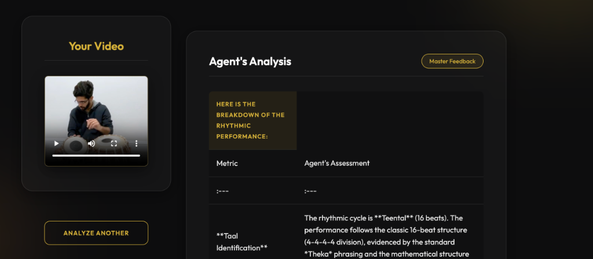

# Tabla Agent #AISprintH2

Built with ❤️ using Google ADK & Powered by Gemini 3.0 Pro

The Tabla is a pair of twin-headed hand drums from the Indian subcontinent, central to Hindustani classical music.



## 🌟 Features
- **Multimodal Rhythmic Analysis**: Leverages **Gemini 3.0 Pro** to analyze video frames and audio for precise timing.
- **Taal Identification**: Automatically detects common Indian beat cycles including **Teental, Dadra, Keherwa, Rupak, Jhaptal, and Ektal**.
- **Sam Detection**: Pinpoints the **exact timestamp (in seconds)** when the player lands on the 'Sam' (the first beat) with technical evaluation.
- **Modern Web Interface**: Advanced side-by-side dashboard with local video preview and structured rhythmic assessment tables.

---

## 🚀 Setup Instructions

### 1. Environment Setup
We recommend using a Conda environment with **Python 3.11+**.

```bash
# Create and activate environment
conda create -n tabla_agent python=3.11
conda activate tabla_agent

# Install dependencies
pip install -r requirements.txt
```

### 2. Configure Google API Key
The agent requires a Google API Key to access the Gemini 3 Pro model.

1. Obtain an API key from [Google AI Studio](https://aistudio.google.com/app/apikey).
2. Create a `.env` file in the project root:
   ```bash
   cp .env.example .env
   ```
3. Open `.env` and replace `your_api_key_here` with your actual key:
   ```env
   GOOGLE_API_KEY=your_actual_key_here
   ```

---

## 🎬 Usage

Start the web server:

```bash
python3 api.py
```

Then open [http://localhost:8000](http://localhost:8000) in your browser and upload your Tabla performance video for instant analysis.

---

## 📂 Project Structure
- `agents/`: Contains `tabla_agent.py` (The Agent's persona and logic).
- `tools/`: `media_utils.py` for input validation and handling.
- `static/`: Modern frontend assets (HTML, CSS, JS).
- `app.py`: Core ADK Runner logic and session management.
- `api.py`: FastAPI backend for the web application.
- `main.py`: CLI execution script.

---

## 🛠️ Technical Stack
- **AI Core**: Google Agent ADK & Gemini 2.0 Flash.
- **Backend**: FastAPI, Uvicorn, Python-dotenv.
- **Frontend**: Vanilla HTML5, Modern CSS (Glassmorphism), JavaScript (ES6+).
- **Media**: Support for MP4, MOV, AVI, and WEBM.
